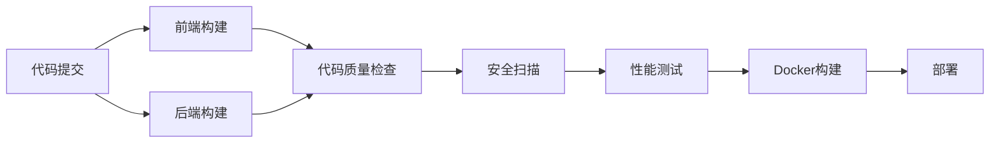

# 饿了么项目 CI/CD 配置说明

本项目已配置完整的 GitHub Actions CI/CD 流水线，支持前端 Vue.js 和后端 Spring Boot 的自动化构建、测试和部署。

## 🏗️ 架构概览

```
┌─────────────────┐    ┌─────────────────┐    ┌─────────────────┐
│   前端 (Vue)    │    │   后端 (Spring) │    │   数据库 (MySQL)│
│   Port: 80      │────│   Port: 8080    │────│   Port: 3306    │
└─────────────────┘    └─────────────────┘    └─────────────────┘
```

## 📋 功能特性

### ✅ 前端 CI/CD
- **构建**: Vue.js + TypeScript + Vite
- **测试**: 类型检查 (vue-tsc)
- **打包**: 生产环境优化构建
- **容器化**: Docker + Nginx 部署

### ✅ 后端 CI/CD
- **构建**: Maven + Java 21
- **测试**: JUnit 5 + Mockito
- **打包**: Spring Boot JAR
- **容器化**: Docker 多阶段构建

### ✅ 质量保证
- **代码质量**: SonarCloud 扫描 (可选)
- **安全扫描**: Trivy 漏洞检测
- **性能测试**: JMeter 自动化测试
- **测试报告**: 自动生成测试报告

### ✅ 部署策略
- **开发环境**: develop 分支自动部署
- **生产环境**: main 分支手动确认部署
- **Docker镜像**: 自动构建和推送
- **监控**: Prometheus + Grafana

## 🚀 快速开始

### 1. 环境准备

```bash
# 克隆项目
git clone <your-repo-url>
cd elemeSpringBoot-main

# 复制环境配置文件
cp env.example .env

# 编辑环境变量
vim .env
```

### 2. 本地开发

```bash
# 启动完整开发环境
docker-compose up -d

# 仅启动基础服务 (MySQL + Redis)
docker-compose up -d mysql redis

# 启动监控服务
docker-compose --profile monitoring up -d
```

### 3. GitHub Actions 配置

#### 必需的 Secrets 设置

在 GitHub 仓库的 Settings > Secrets and variables > Actions 中添加：

```
DOCKER_USERNAME     # Docker Hub 用户名
DOCKER_PASSWORD     # Docker Hub 密码或令牌
```

#### 可选的 Secrets

```
SONAR_TOKEN        # SonarCloud 令牌 (代码质量检查)
SSH_PRIVATE_KEY    # 部署服务器 SSH 私钥
SERVER_HOST        # 部署服务器地址
SERVER_USER        # 部署服务器用户名
```

## 🔄 工作流程

### 分支策略

- **main**: 生产环境分支
  - 触发完整的 CI/CD 流程
  - 包含性能测试和安全扫描
  - 需要手动确认部署

- **develop**: 开发环境分支
  - 自动构建和测试
  - 自动部署到开发环境

- **feature/***: 功能分支
  - Pull Request 时触发构建和测试

### CI/CD 流程图



## 📊 监控和报告

### 访问地址

- **应用**: http://localhost:80
- **后端API**: http://localhost:8080
- **API文档**: http://localhost:8080/doc.html
- **Prometheus**: http://localhost:9090
- **Grafana**: http://localhost:3000 (admin/admin123)

### 测试报告

CI/CD 流程会自动生成以下报告：

1. **单元测试报告**: 在 Actions 的测试步骤中查看
2. **性能测试报告**: 在 Artifacts 中下载
3. **安全扫描报告**: 在 Security 标签页查看
4. **代码覆盖率**: SonarCloud 仪表板

## 🛠️ 常用命令

### 本地开发

```bash
# 前端开发
cd elemeVue
npm install
npm run dev

# 后端开发
cd elemeSpringBoot
mvn clean compile
mvn spring-boot:run

# 运行测试
mvn test
npm run type-check
```

### Docker 操作

```bash
# 构建镜像
docker-compose build

# 查看日志
docker-compose logs -f backend
docker-compose logs -f frontend

# 重启服务
docker-compose restart backend

# 清理
docker-compose down -v
docker system prune -a
```

### 生产部署

```bash
# 生产环境部署
docker-compose --profile production up -d

# 更新应用
docker-compose pull
docker-compose up -d --no-deps backend frontend
```

## 🔧 自定义配置

### 修改 GitHub Actions

编辑 `.github/workflows/ci-cd.yml` 文件：

- 调整 Java/Node.js 版本
- 修改测试命令
- 添加部署步骤
- 配置通知

### 添加新的检查

1. **代码规范检查**:
```yaml
- name: 代码格式检查
  run: |
    cd elemeVue && npm run lint
    cd elemeSpringBoot && mvn checkstyle:check
```

2. **集成测试**:
```yaml
- name: 集成测试
  run: mvn verify -P integration-test
```

## 🚨 故障排除

### 常见问题

1. **构建失败**
   - 检查依赖版本兼容性
   - 查看构建日志中的错误信息
   - 确认环境变量配置正确

2. **测试失败**
   - 检查数据库连接配置
   - 确认测试数据准备正确
   - 查看测试报告详情

3. **部署失败**
   - 检查 Docker 镜像是否成功构建
   - 确认服务器连接和权限
   - 查看容器日志

### 调试技巧

```bash
# 查看 GitHub Actions 日志
# 在 GitHub 仓库的 Actions 标签页查看详细日志

# 本地调试 Docker 构建
docker build -t eleme-backend ./elemeSpringBoot
docker run -it --rm eleme-backend /bin/sh

# 测试 GitHub Actions 本地化
# 使用 act 工具: https://github.com/nektos/act
act -j frontend-build
```

## 📚 相关文档

- [Spring Boot 官方文档](https://spring.io/projects/spring-boot)
- [Vue.js 官方文档](https://vuejs.org/)
- [GitHub Actions 文档](https://docs.github.com/en/actions)
- [Docker 官方文档](https://docs.docker.com/)
- [JMeter 文档](https://jmeter.apache.org/usermanual/index.html)

## 🤝 贡献指南

1. Fork 本项目
2. 创建功能分支: `git checkout -b feature/your-feature`
3. 提交更改: `git commit -am 'Add some feature'`
4. 推送分支: `git push origin feature/your-feature`
5. 创建 Pull Request

---

💡 **提示**: 如果您在使用过程中遇到问题，请查看 [Issues](../../issues) 或创建新的 Issue。 